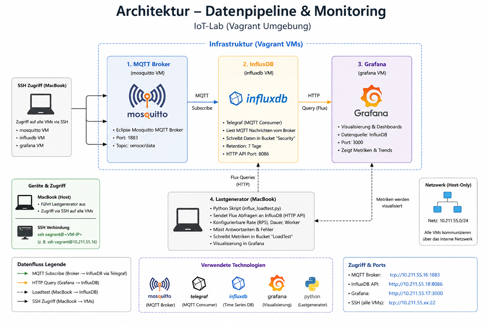

# Security_Projekt

## Projektübersicht
In diesem Projekt habe ich eine Umgebung mit Grafana und Influxb aufgebaut. Das Ziel ist es einen Lastentest zu machen auf Influxdb. Die Daten werden dann ausgewertet und mit den Grafanadashboards dargestellt. Dieses Projekt dient einer Angriffsimulation.

Die gesamte Umgebung läuft auf verschiedenen Ubunut-VM's die mit einem Vagrantfile erstellt wurden.

## Ziel des Projektes

1. Vagrantfile erstellen
2. Grafana und Influxdb einrichten
3. Script für den Lastentest erstellen
4. Lastentest durchführen
5. Grafanadashboards erstellen

## Architektur



Das Projekt beinhaltet folgende Komponenten:

| Komponente | Aufgabe |
|------------|---------|
| **Vagrant** | Zum erstellen, verwalten und starten sowie stoppen der virtuellen Maschinen|
| **Grafana** | Zur grafischen Darstellung des Lastentests auf Influxdb |
| **Influxdb** | Zum speichern der Messdaten vom Lastentest   |
| **Lastenscript** | Zur Ausführen des Lastentest |

## Voraussetzungen

1. Git
2. Virtualbox oder Paralles
3. Vagrant 2.4 oder neuer
4. Mindestens 4GB Arbeitsspeicher
5. Mindestens 10GB RAM
6. Internentanbindung

# Installation und Konfiguration

## 1. Installation von Vagrant

Für die Verwaltung und Bereitstellung der virtuellen Maschinen wird Vagrant verwendet. Als Virtualisierungsplattform kommt Parallels Desktop zum Einsatz.

Nach der Installation von Vagrant kann überprüft werden, ob Vagrant korrekt verfügbar ist:

```bash
vagrant --version
```

Anschließend wird das Vagrant-Plugin für Parallels installiert:

```bash
vagrant plugin install vagrant-parallels
```

Die erfolgreiche Installation des Plugins kann mit folgendem Befehl überprüft werden:

```bash
vagrant plugin list
```

In der Ausgabe sollte `vagrant-parallels` aufgeführt sein.

---

## 2. Vagrant-Projekt

Für die Testumgebung wird ein eigener Projektordner verwendet. Ein möglicher Beispielpfad ist:

```text
~/Documents/influxdb-test/
```

In diesem Verzeichnis befindet sich die Datei:

```text
Vagrantfile
```

Das Vagrantfile enthält die Konfiguration der virtuellen Maschinen. Für die Testumgebung werden zwei Ubuntu-Server verwendet:

- **InfluxDB-VM**
- **Grafana-VM**

Die virtuellen Maschinen werden ohne grafische Benutzeroberfläche betrieben und über SSH administriert.

---

## 3. Virtuelle Maschinen erstellen

Zunächst wird im Terminal in das Verzeichnis gewechselt, in dem sich das Vagrantfile befindet:

```bash
cd ~/Documents/influxdb-test/
```

Anschließend werden die virtuellen Maschinen erstellt und mit Parallels gestartet:

```bash
vagrant up --provider=parallels
```

Beim ersten Start lädt Vagrant die benötigten Images herunter und erstellt daraus die virtuellen Maschinen. Dieser Vorgang kann einige Minuten dauern.

Der Status der virtuellen Maschinen kann anschließend überprüft werden:

```bash
vagrant status
```

Die Ausgabe sollte beispielsweise folgende Maschinen anzeigen:

```text
influxdb    running
grafana     running
```

Eine einzelne virtuelle Maschine kann ebenfalls separat gestartet werden:

```bash
vagrant up influxdb
```

beziehungsweise:

```bash
vagrant up grafana
```

---

## 4. Zugriff auf die virtuellen Maschinen

Die Administration der virtuellen Maschinen erfolgt über SSH.

Für den Zugriff auf die InfluxDB-VM wird folgender Befehl verwendet:

```bash
vagrant ssh influxdb
```

Für die Grafana-VM:

```bash
vagrant ssh grafana
```

Die IP-Adresse einer virtuellen Maschine kann innerhalb der jeweiligen VM beispielsweise mit folgendem Befehl angezeigt werden:

```bash
hostname -I
```

Die ermittelten IP-Adressen werden später für die Kommunikation zwischen Grafana, InfluxDB und dem MacBook benötigt.

---

## 5. Ubuntu aktualisieren

Nach dem ersten Start der virtuellen Maschinen wird Ubuntu aktualisiert.

Dazu werden auf beiden VMs folgende Befehle ausgeführt:

```bash
sudo apt update
sudo apt upgrade -y
```

Damit befinden sich die installierten Pakete auf einem aktuellen Stand.

---

# 6. Installation und Konfiguration von InfluxDB

## 6.1 Aufgabe von InfluxDB

InfluxDB wird als Zeitreihendatenbank eingesetzt und stellt gleichzeitig das Ziel des Lasttests dar.

Das Python-Skript sendet eine konfigurierbare Anzahl von Abfragen an InfluxDB und misst deren Antwortzeiten.

Die Ergebnisse des Lasttests werden anschließend ebenfalls in InfluxDB gespeichert.

Zu den gespeicherten Messwerten gehören unter anderem:

- Anzahl der Anfragen
- erfolgreiche Anfragen
- fehlgeschlagene Anfragen
- durchschnittliche Antwortzeit
- P95-Antwortzeit

---

## 6.2 InfluxDB-Dienst

Nach der Installation von InfluxDB kann überprüft werden, ob der Dienst läuft:

```bash
sudo systemctl status influxdb
```

Falls der Dienst nicht gestartet ist, kann er mit folgendem Befehl gestartet werden:

```bash
sudo systemctl start influxdb
```

Damit InfluxDB bei jedem Start der VM automatisch gestartet wird:

```bash
sudo systemctl enable influxdb
```

InfluxDB verwendet standardmäßig den TCP-Port:

```text
8086
```

---

## 6.3 Zugriff auf die InfluxDB-Weboberfläche

Die Weboberfläche von InfluxDB wird über einen Browser auf dem Host-System aufgerufen.

Dazu wird die IP-Adresse der InfluxDB-VM verwendet:

```text
http://<INFLUXDB-IP>:8086
```

Beispiel:

```text
http://10.211.55.20:8086
```

Die tatsächliche IP-Adresse hängt von der jeweiligen virtuellen Netzwerkumgebung ab und muss entsprechend angepasst werden.

---

## 6.4 InfluxDB konfigurieren

Beim ersten Aufruf von InfluxDB wird die Grundkonfiguration durchgeführt.

Dabei werden unter anderem folgende Informationen festgelegt:

- Benutzername
- Passwort
- Organisation
- Bucket

Für die Organisation kann beispielsweise folgender Name verwendet werden:

```text
Iot
```

Für die Ergebnisse des Lasttests wird ein eigener Bucket angelegt:

```text
LoadTest
```

Dadurch werden die Lasttestdaten getrennt von anderen Daten gespeichert.

---

## 6.5 API-Token

Für den Zugriff über die InfluxDB-API wird ein API-Token benötigt.

Dieser Token wird unter anderem vom Python-Lasttest verwendet.

Aus Sicherheitsgründen wird der Token nicht direkt im Python-Skript gespeichert. Stattdessen wird auf dem Host-System eine Umgebungsvariable verwendet:

```bash
export INFLUX_TOKEN='INFLUXDB_TOKEN_HIER_EINSETZEN'
```

Ob die Variable gesetzt wurde, kann mit folgendem Befehl überprüft werden:

```bash
echo $INFLUX_TOKEN
```

Der tatsächliche Token sollte nicht in einer öffentlichen Dokumentation oder einem öffentlichen Git-Repository gespeichert werden.

Wird ein neues Terminal geöffnet, muss die Umgebungsvariable erneut gesetzt werden.

---

# 7. Installation und Konfiguration von Grafana

## 7.1 Aufgabe von Grafana

Grafana dient zur Visualisierung und Auswertung der Lasttestergebnisse.

Die Daten werden nicht direkt in Grafana gespeichert. Grafana verwendet InfluxDB als Datenquelle und fragt die dort gespeicherten Messwerte ab.

---

## 7.2 Grafana-Dienst

Nach der Installation von Grafana wird der Dienst gestartet:

```bash
sudo systemctl start grafana-server
```

Damit Grafana nach einem Neustart der virtuellen Maschine automatisch gestartet wird:

```bash
sudo systemctl enable grafana-server
```

Der Status kann mit folgendem Befehl kontrolliert werden:

```bash
sudo systemctl status grafana-server
```

Grafana verwendet standardmäßig den Port:

```text
3000
```

---

## 7.3 Zugriff auf Grafana

Die Grafana-Weboberfläche wird auf dem Host-System über einen Browser geöffnet:

```text
http://<GRAFANA-IP>:3000
```

Beispiel:

```text
http://10.211.55.21:3000
```

Die IP-Adresse muss entsprechend der eigenen virtuellen Maschine angepasst werden.

---

# 8. InfluxDB als Datenquelle in Grafana

Damit Grafana auf die Lasttestdaten zugreifen kann, wird InfluxDB als Datenquelle eingerichtet.

In der Grafana-Weboberfläche wird dazu folgender Bereich geöffnet:

```text
Connections
→ Data sources
→ Add data source
→ InfluxDB
```

Als Abfragesprache wird **Flux** verwendet.

Für die Verbindung werden folgende Angaben benötigt:

```text
URL:
http://<INFLUXDB-IP>:8086

Organization:
Iot

Token:
<INFLUXDB-TOKEN>

Default Bucket:
LoadTest
```

Anschließend wird die Konfiguration gespeichert und die Verbindung getestet.

Bei erfolgreicher Konfiguration kann Grafana auf die in InfluxDB gespeicherten Buckets und Messwerte zugreifen.

---

# 9. Python-Umgebung für den Lasttest

Der Lastgenerator wird direkt auf dem Host-System ausgeführt.

Für das Python-Skript wird eine virtuelle Python-Umgebung verwendet. Dadurch werden zusätzliche Python-Pakete nicht systemweit installiert.

Zunächst wird in einen beliebigen Projektordner gewechselt:

```bash
cd ~/Documents/influxdb-test/
```

Anschließend wird eine virtuelle Umgebung erstellt:

```bash
python3 -m venv venv
```

Die Umgebung wird aktiviert mit:

```bash
source venv/bin/activate
```

Nach erfolgreicher Aktivierung wird normalerweise `(venv)` vor der Eingabeaufforderung angezeigt.

Das vom Skript benötigte Python-Paket `requests` wird innerhalb dieser Umgebung installiert:

```bash
python3 -m pip install requests
```

Die virtuelle Umgebung kann später wieder verlassen werden:

```bash
deactivate
```

Sie kann bei einem späteren Test erneut aktiviert werden:

```bash
source venv/bin/activate
```

---

# 10. Lasttest-Skript

Für die Durchführung des Lasttests wird das Python-Skript

```text
influx_loadtest.py
```

verwendet.

Das Skript befindet sich beispielsweise unter:

```text
~/Documents/influxdb-test/influx_loadtest.py
```

Das Skript sendet eine konfigurierbare Anzahl von HTTP-Anfragen an die InfluxDB-API.

Die Belastung kann über drei wichtige Parameter gesteuert werden:

| Parameter | Bedeutung |
|---|---|
| `--rps` | Gewünschte Anzahl der Requests pro Sekunde |
| `--duration` | Dauer des Tests in Sekunden |
| `--workers` | Anzahl parallel arbeitender Worker |

Zusätzlich werden die Antwortzeiten sowie erfolgreiche und fehlgeschlagene Anfragen erfasst.

Die daraus erzeugten Messwerte werden im InfluxDB-Bucket `LoadTest` gespeichert.

---

# 11. Lasttest durchführen

Vor dem Start des Lasttests wird zunächst in das Projektverzeichnis gewechselt:

```bash
cd ~/Documents/influxdb-test/
```

Danach wird die virtuelle Python-Umgebung aktiviert:

```bash
source venv/bin/activate
```

Anschließend wird der InfluxDB-Token als Umgebungsvariable gesetzt:

```bash
export INFLUX_TOKEN='INFLUXDB_TOKEN_HIER_EINSETZEN'
```

Danach kann der Lasttest gestartet werden.

Ein Test mit geringer Last kann beispielsweise folgendermaßen durchgeführt werden:

```bash
python3 influx_loadtest.py --rps 10 --duration 60 --workers 10
```

Ein Test mit höherer Last:

```bash
python3 influx_loadtest.py --rps 100 --duration 60 --workers 50
```

Ein weiterer Test mit hoher Last:

```bash
python3 influx_loadtest.py --rps 200 --duration 60 --workers 100
```

Die Last sollte schrittweise erhöht werden. Dadurch kann beobachtet werden, wie sich InfluxDB bei zunehmender Belastung verhält.

Die Tests werden ausschließlich gegen die eigene Testumgebung durchgeführt.

---

# 12. Erfasste Messwerte

Während beziehungsweise nach einem Lasttest werden verschiedene Kennzahlen erfasst.

| Messwert | Beschreibung |
|---|---|
| `requests` | Anzahl der ausgeführten Anfragen |
| `successes` | Anzahl der erfolgreichen Anfragen |
| `errors` | Anzahl der fehlgeschlagenen Anfragen |
| `avg_latency_ms` | Durchschnittliche Antwortzeit in Millisekunden |
| `p95_latency_ms` | Antwortzeit, unter der 95 % der Anfragen liegen |

Diese Messwerte werden in InfluxDB gespeichert und anschließend mit Grafana visualisiert.

---

# 13. Grafana-Dashboard konfigurieren

Für die Darstellung der Lasttestergebnisse wird in Grafana ein Dashboard erstellt.

Als Datenquelle wird die zuvor konfigurierte InfluxDB-Datenquelle ausgewählt.

Die Daten befinden sich im Bucket:

```text
LoadTest
```

Eine grundlegende Flux-Abfrage für die Lasttestdaten lautet:

```flux
from(bucket: "LoadTest")
  |> range(start: v.timeRangeStart)
  |> filter(fn: (r) => r._measurement == "loadtest")
```

Für einzelne Messwerte kann zusätzlich nach `_field` gefiltert werden.

Beispielsweise für die durchschnittliche Antwortzeit:

```flux
from(bucket: "LoadTest")
  |> range(start: v.timeRangeStart)
  |> filter(fn: (r) => r._measurement == "loadtest")
  |> filter(fn: (r) => r._field == "avg_latency_ms")
```

Für Fehler:

```flux
from(bucket: "LoadTest")
  |> range(start: v.timeRangeStart)
  |> filter(fn: (r) => r._measurement == "loadtest")
  |> filter(fn: (r) => r._field == "errors")
```

Für die P95-Antwortzeit:

```flux
from(bucket: "LoadTest")
  |> range(start: v.timeRangeStart)
  |> filter(fn: (r) => r._measurement == "loadtest")
  |> filter(fn: (r) => r._field == "p95_latency_ms")
```

---

# 14. Dashboard-Aufbau

Das Dashboard kann beispielsweise aus folgenden Panels bestehen:

- Requests
- Successful Requests
- Errors
- Average Latency
- Requests per Second
- Average Response Time
- P95 Response Time

Für einzelne Kennzahlen können `Stat`- oder `Gauge`-Visualisierungen eingesetzt werden.

Für die Analyse der zeitlichen Entwicklung eignen sich `Time series`-Diagramme. Damit kann beispielsweise dargestellt werden, ob die Antwortzeiten mit zunehmender Last ansteigen.

Als Zeitraum kann beispielsweise eingestellt werden:

```text
Last 15 minutes
```

Für eine laufende Beobachtung kann zusätzlich ein automatisches Aktualisierungsintervall, beispielsweise von fünf Sekunden, verwendet werden.

---

# 15. Auswertung der Lasttests

Für die Auswertung werden mehrere Lasttests mit unterschiedlichen Belastungsstufen durchgeführt.

Dabei werden insbesondere folgende Werte miteinander verglichen:

- Anzahl der Anfragen
- Anzahl der erfolgreichen Anfragen
- Anzahl der Fehler
- durchschnittliche Antwortzeit
- P95-Antwortzeit

Die Grafana-Abfragen müssen für neue Lasttests nicht erneut erstellt werden. Die Panels greifen weiterhin auf den Bucket `LoadTest` zu und stellen neu gespeicherte Messwerte automatisch dar.

Von besonderem Interesse ist, wie sich die Antwortzeiten bei zunehmender Anzahl von Requests entwickeln.

Auch wenn bei einem Lasttest keine Fehler auftreten, ist dies ein relevantes Ergebnis. In diesem Fall konnte die InfluxDB-Instanz die getestete Belastung mit den vorhandenen Ressourcen erfolgreich verarbeiten.

---

# 16. Testumgebung stoppen und starten

Nach Abschluss der Tests können die virtuellen Maschinen heruntergefahren werden.

Dazu wird zunächst in das Verzeichnis mit dem Vagrantfile gewechselt:

```bash
cd ~/Documents/influxdb-test/
```

Anschließend werden alle VMs sauber heruntergefahren:

```bash
vagrant halt
```

Der Status kann überprüft werden:

```bash
vagrant status
```

Für einen späteren Test können die Maschinen wieder gestartet werden:

```bash
vagrant up
```

Alternativ können sie einzeln gestartet werden:

```bash
vagrant up influxdb
```

```bash
vagrant up grafana
```

Mit `vagrant halt` werden die virtuellen Maschinen lediglich ausgeschaltet. Die Konfiguration und gespeicherten Daten bleiben erhalten.

Der Befehl

```bash
vagrant destroy
```

sollte nur verwendet werden, wenn die virtuellen Maschinen vollständig gelöscht werden sollen.


